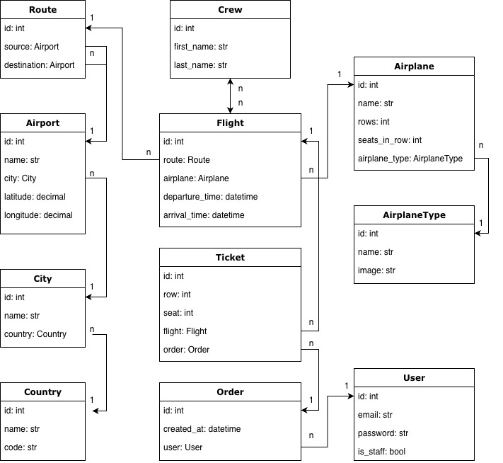
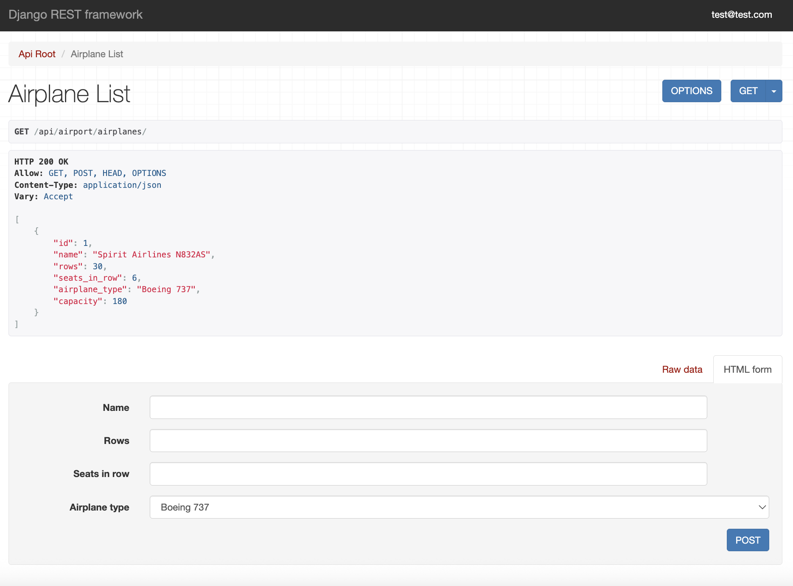

# Airport API

API service for airport management built with Django REST Framework.

## Features
- Airport service with a wide range of models to manage flights
- Custom user model with email as username
- JWT token authentication and permissions for enhanced security
- Flight booking functionality with Orders and Tickets
- Flight filtering by source city, destination city, departure and arrival date
- Admin panel for managing users, airport related and booking data
- API documentation via Swagger UI

## DB schema


## Installing / Getting started

Run via Docker:
Docker should be installed
```shell
git clone https://github.com/dmitriy-kds/airport
cd airport
cp .env.sample .env  # fill in the required values
docker-compose up --build
```
The app will be available at http://localhost:8000
API documentation: http://localhost:8000/api/doc/swagger/
To create a superuser:
```shell
docker-compose exec app python manage.py createsuperuser

```

Run locally:
Install PostgresSQL and create db
```shell
git clone https://github.com/dmitriy-kds/airport
cd airport
python3 -m venv venv
source venv/bin/activate
pip install -r requirements.txt
python manage.py migrate
python manage.py runserver
```
To create a superuser:
```shell
python manage.py createsuperuser

```

## Demo

